# IT OPERATIONS APPLICATION — WIREFLOW ARCHITECTURE

## Purpose

Connect ordinary staff, branch managers, IT teams, owners, vendors, platform support, applications, printers, integrations, monitoring, incidents, changes, and recovery through one controlled technical-operations lifecycle.

# 1. Staff contextual support flow

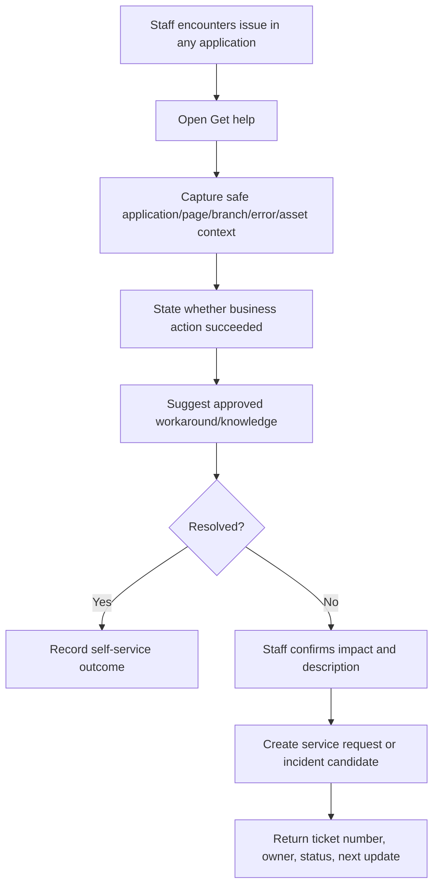

# 2. Service request lifecycle

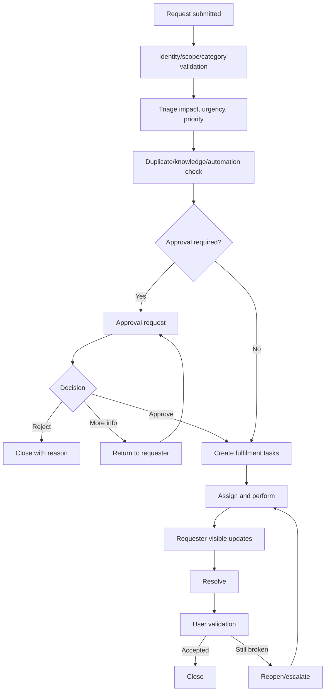

# 3. Monitoring alert to incident

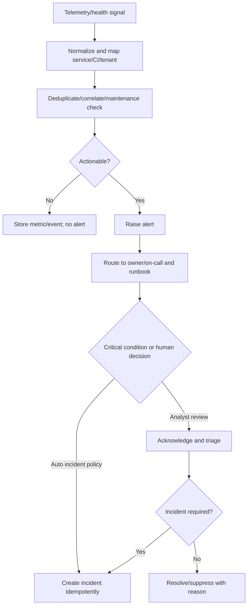

# 4. Major incident flow

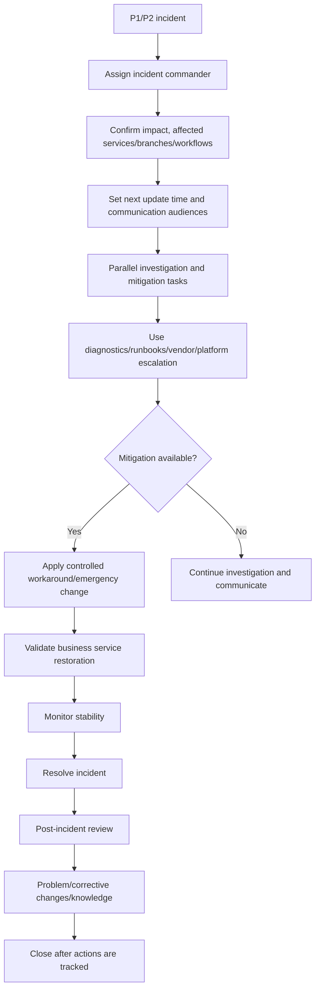

# 5. Incident communication flow

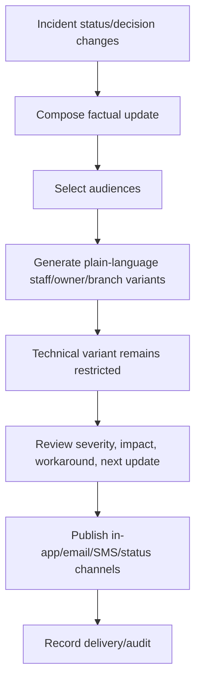

# 6. Problem and permanent fix flow

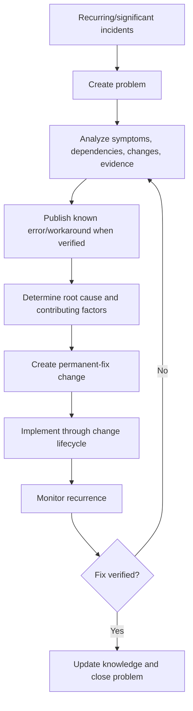

# 7. Normal change flow

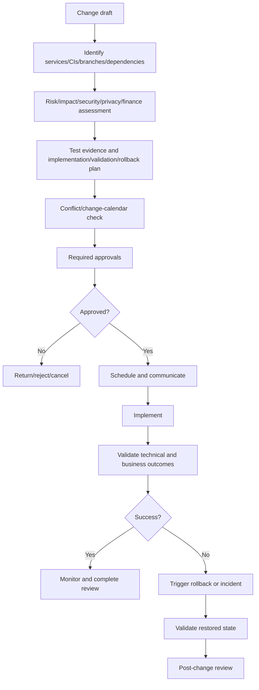

# 8. Emergency change flow

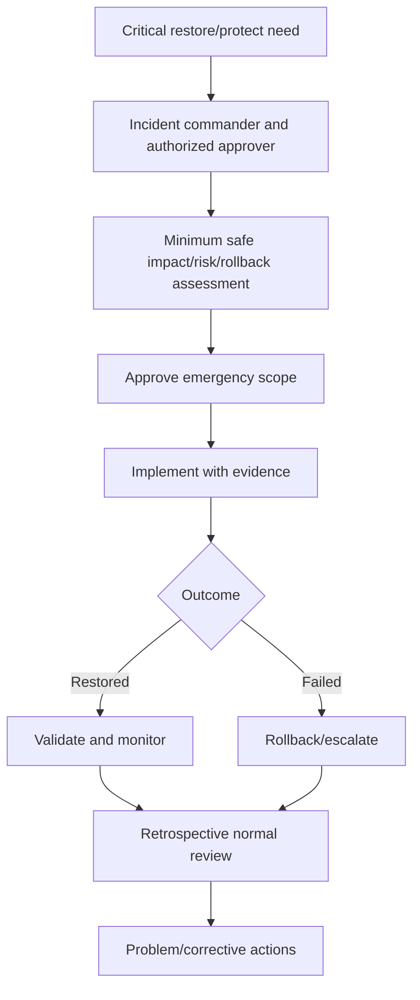

# 9. Asset onboarding flow

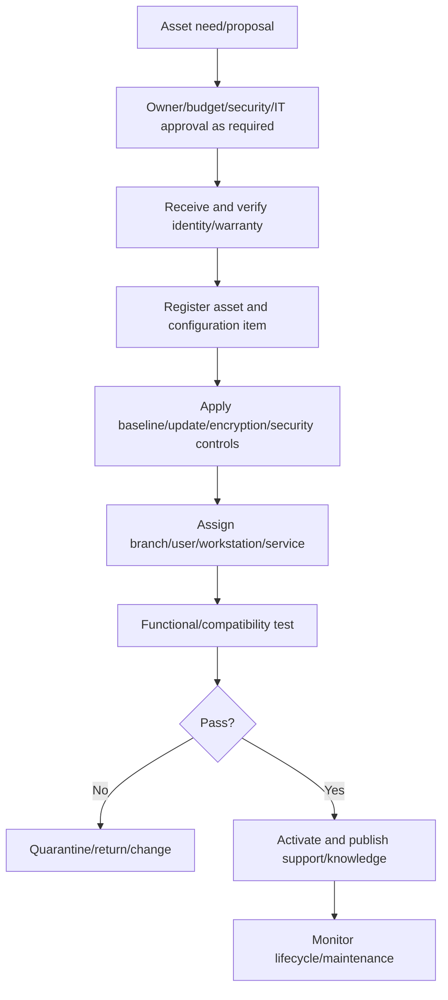

# 10. Printer onboarding/support flow

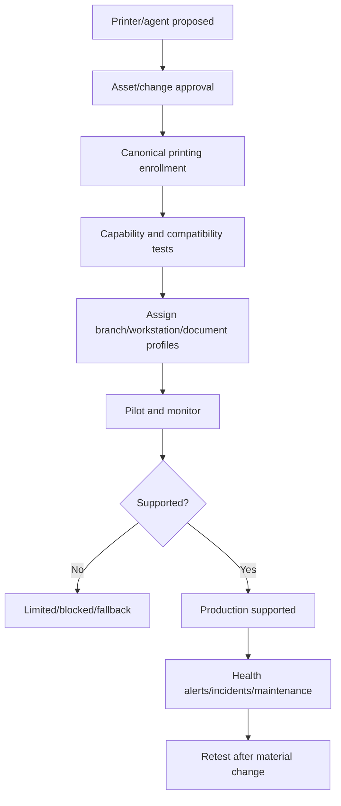

# 11. Access request flow

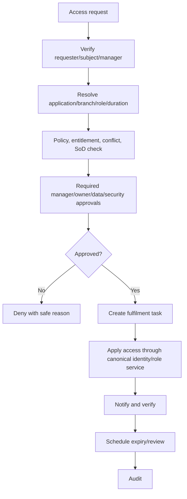

# 12. Integration incident flow

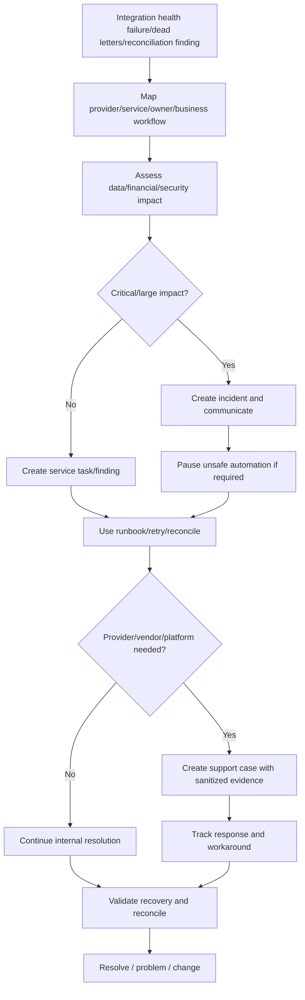

# 13. Runbook execution flow

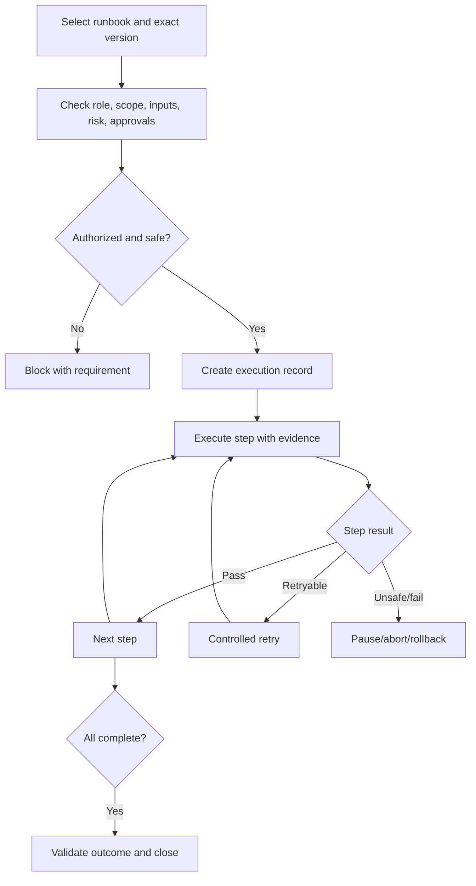

# 14. Platform support access flow

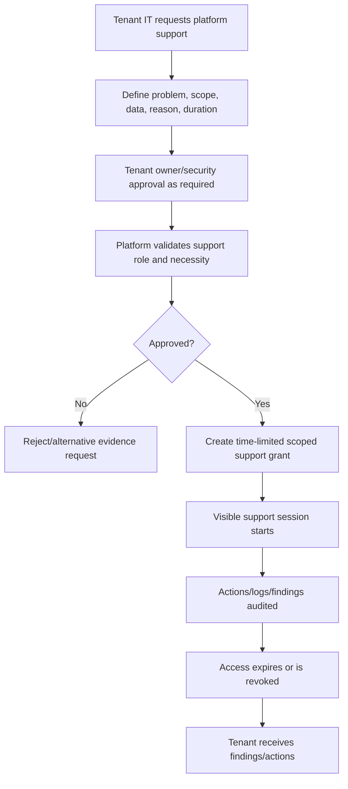

# 15. Vendor support flow

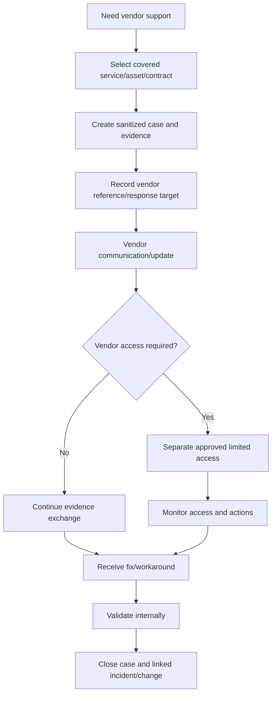

# 16. Backup/restore request flow

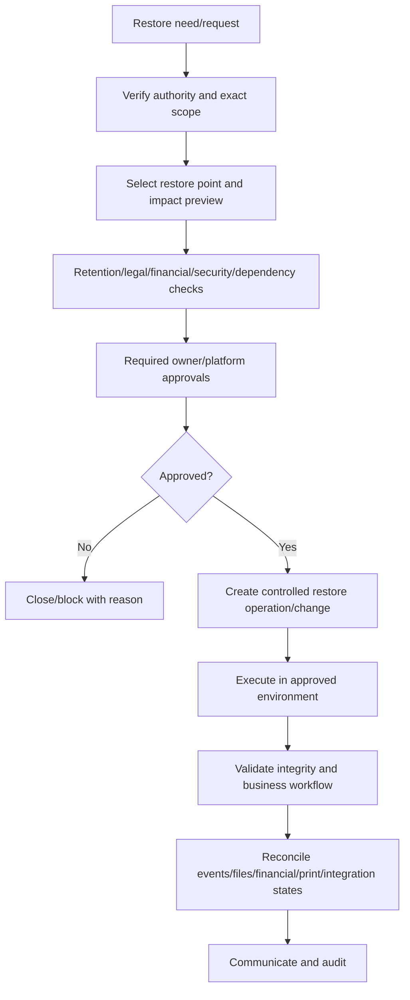

# 17. Knowledge publication flow

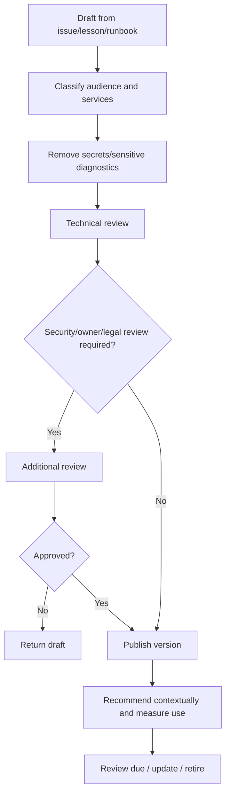

# 18. Owner governance flow

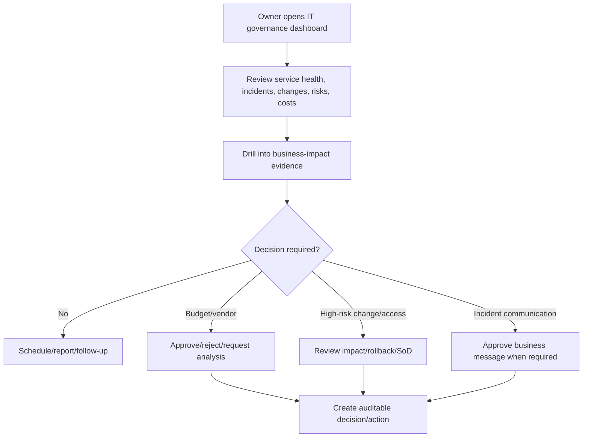

# 19. Cross-department technical handoff flow

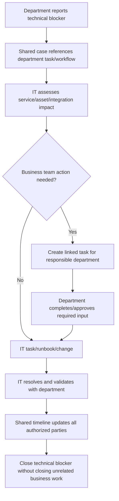

# 20. Universal failure and escalation flow

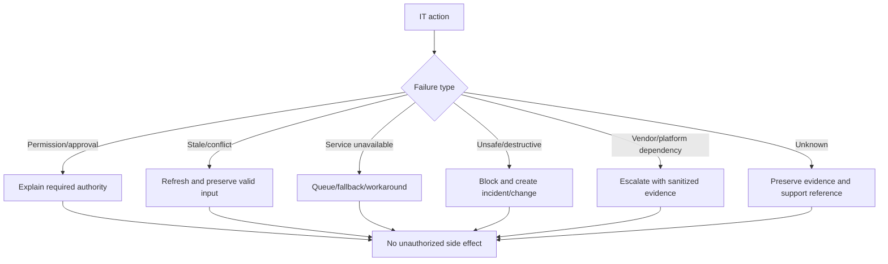

## Cross-application connections

- All application help panels create shared ServiceRequest/Incident records.
- Business records are referenced through safe typed links, not copied into IT records.
- IT tasks can block a business workflow step but cannot silently change its domain status.
- Resolution requires confirmation from affected department when business validation is necessary.
- Incident communications and maintenance notices route by department, branch, role, service, and workflow impact.
- Printer and integration events feed IT monitoring/incident workflows.
- Owner receives aggregated cross-department business impact and approvals.

## Completion rule

Each flow has trigger, source, destination, readiness checks, owner, result, failure/recovery, communication, and audit. No department is treated as an isolated application island.
