# WIREFLOW ARCHITECTURE — TECHNICIAN REPAIR SAAS

## PURPOSE

This is the single canonical wireflow for navigation, decisions, handoffs, exceptions, and user-visible state changes across the ARCHITECTURED Technician Repair SaaS.

The wireflow connects approved workflows to the canonical wireframes. It does not redefine domain rules or allow users to skip lifecycle gates.

## GOVERNANCE

- Follow `1plan.md`, the shared lifecycle, and the cross-application handoff matrix.
- No screen may create an illegal lifecycle transition.
- Every handoff has a source, destination, readiness check, result, and failure path.
- Customer-visible language is simpler than internal operational status but maps to the same authoritative state.
- Back, cancel, save-draft, retry, and resume behavior must preserve valid data.
- Current scope is documentation only; no code.

# 1. ENTRY AND ROUTING WIREFLOW

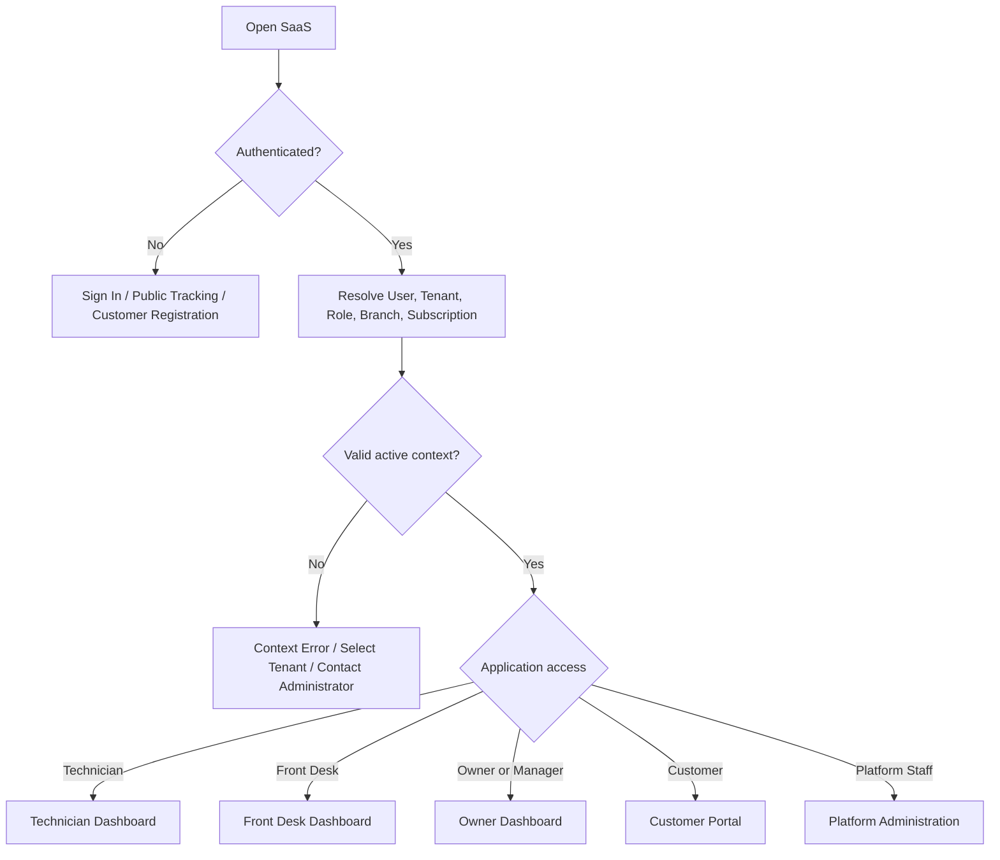

# 2. CUSTOMER REQUEST TO JOB ORDER WIREFLOW

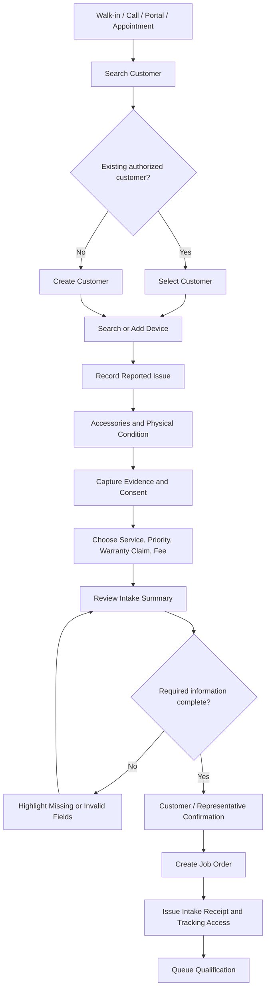

## Intake Failure Paths

- Duplicate customer or device: show possible match and require authorized merge or selection.
- Evidence upload failure: preserve intake draft and permit retry or approved alternate capture.
- Signature unavailable: follow tenant-approved alternative confirmation.
- Offline intake: assign unique local operation ID and reconcile before creating another job.

# 3. QUEUE, DISPATCH, AND ACCEPTANCE WIREFLOW

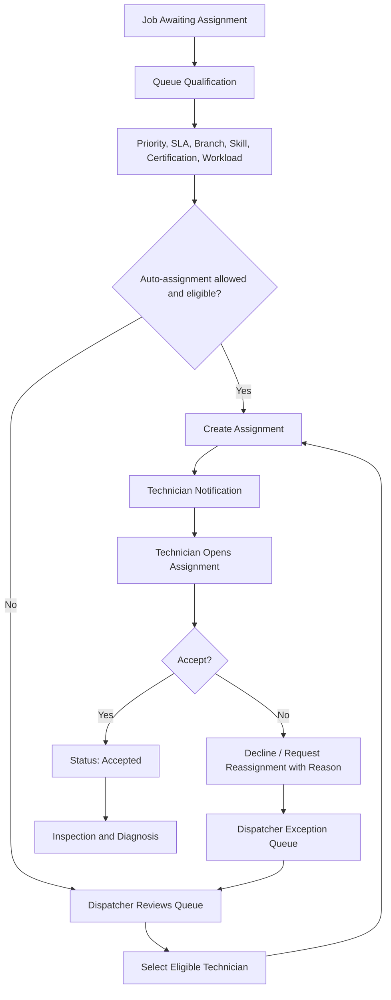

## Queue UX Rules

- Show the reason a job is prioritized.
- Show SLA risk without exposing owner-only data.
- Do not allow a technician to claim an ineligible or locked job.
- Reassignment keeps assignment history.

# 4. TECHNICIAN DIAGNOSIS WIREFLOW

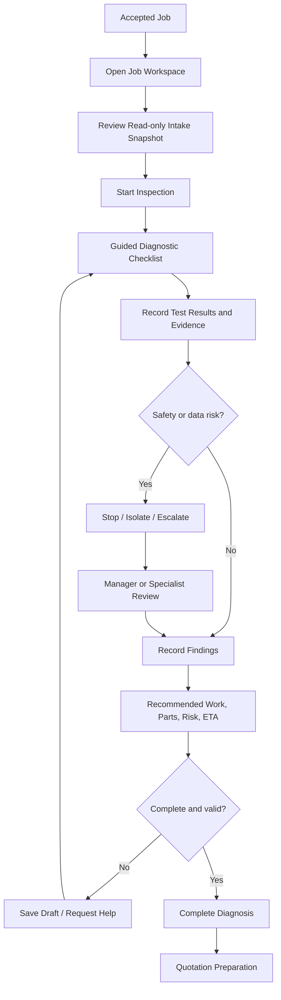

# 5. QUOTATION AND CUSTOMER APPROVAL WIREFLOW

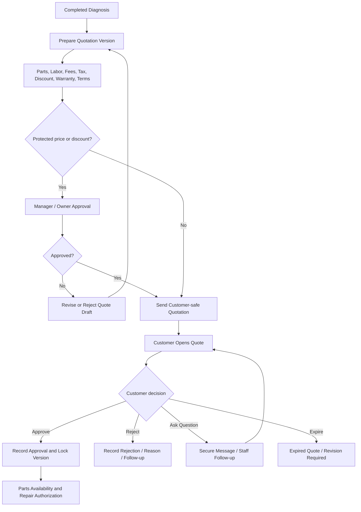

## Approval Rules

- Approval applies to one exact quotation version.
- New price-affecting changes require a new version and new approval.
- Staff cannot record customer approval without authorized evidence.

# 6. PARTS AND INVENTORY WIREFLOW

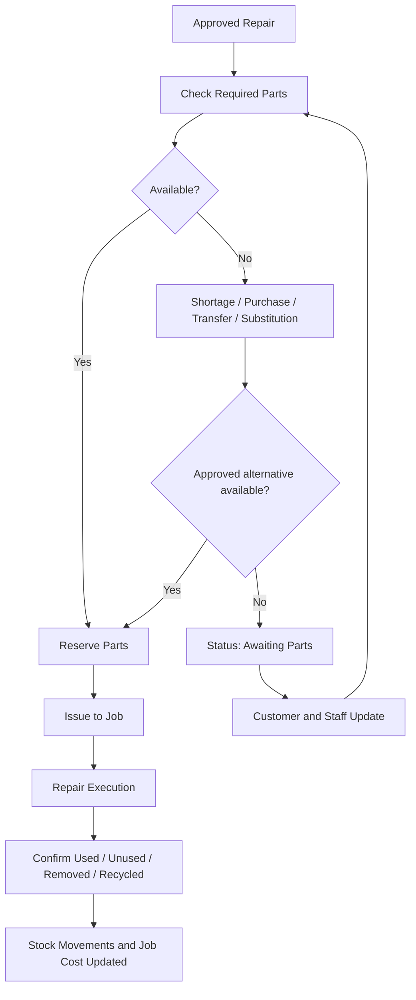

# 7. REPAIR EXECUTION WIREFLOW

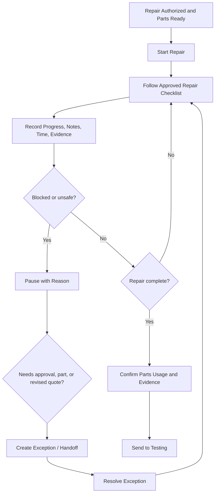

# 8. TESTING, QUALITY, AND REWORK WIREFLOW

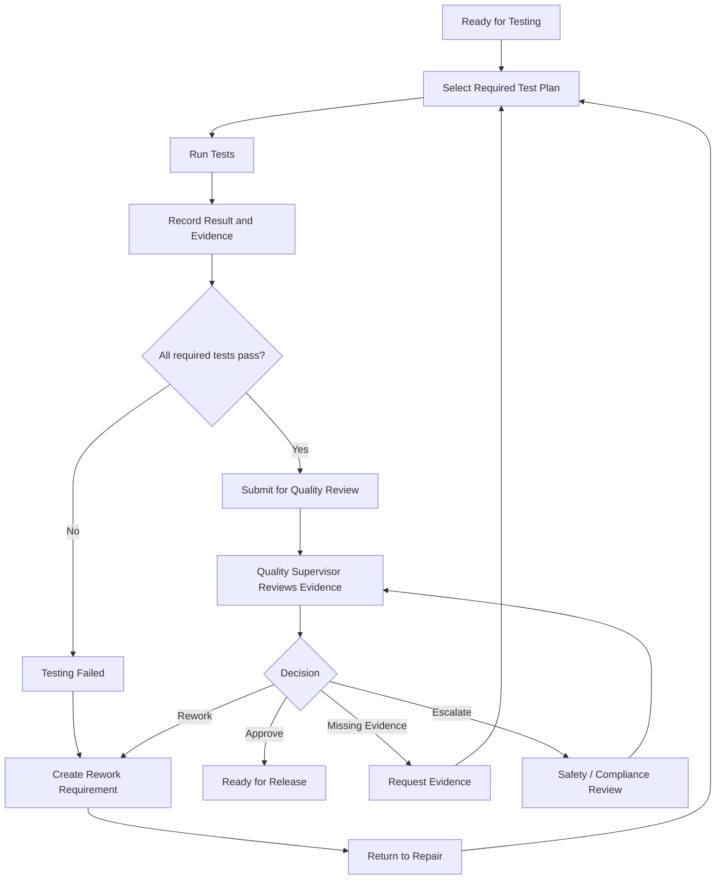

# 9. INVOICE, PAYMENT, AND RELEASE WIREFLOW

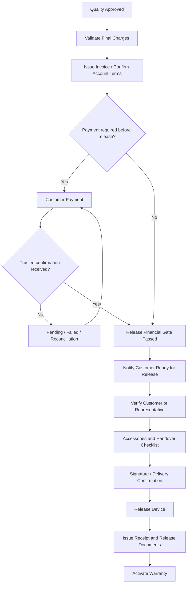

# 10. CUSTOMER PORTAL WIREFLOW

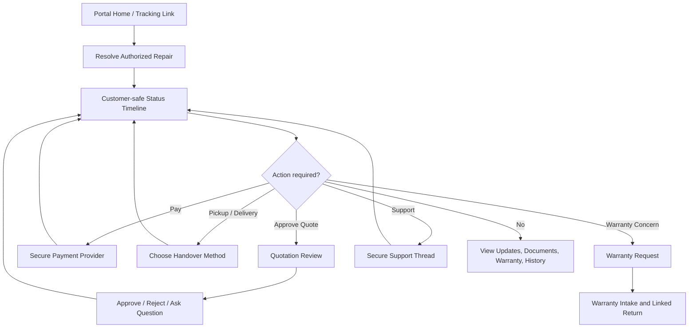

# 11. WARRANTY RETURN WIREFLOW

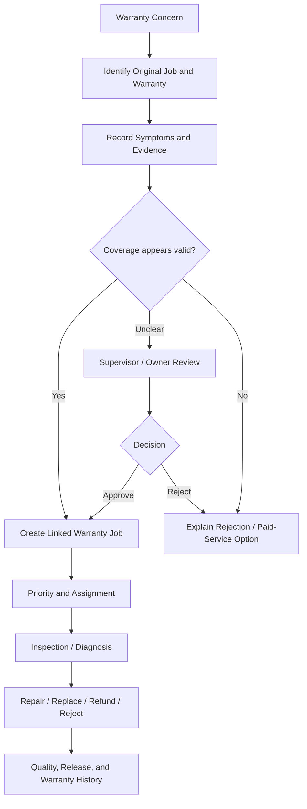

# 12. OWNER APPROVAL WIREFLOW

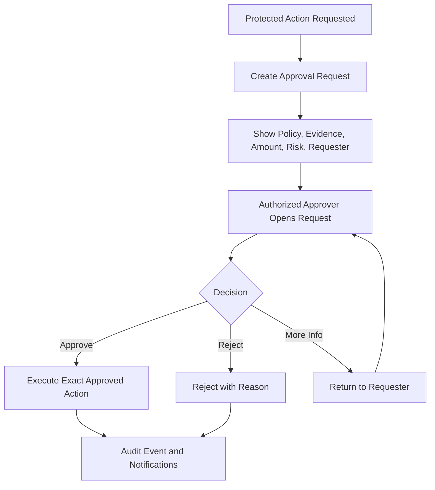

# 13. CONFIGURATION PUBLISH WIREFLOW

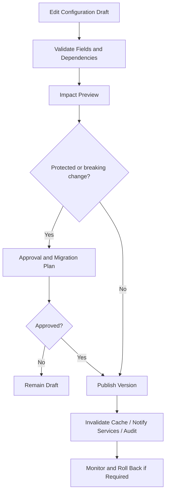

# 14. SUBSCRIPTION AND TENANT LIFECYCLE WIREFLOW

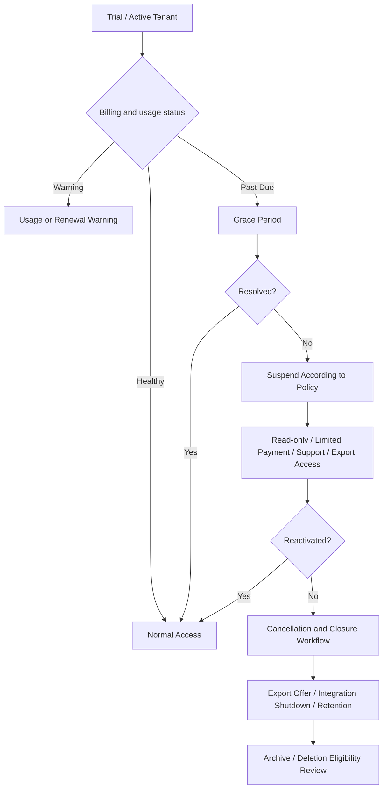

# 15. SUPPORT ACCESS WIREFLOW

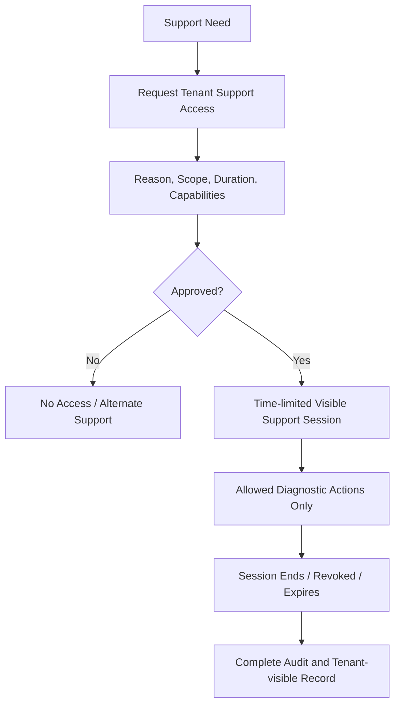

# 16. ERROR, RETRY, AND RECOVERY WIREFLOW

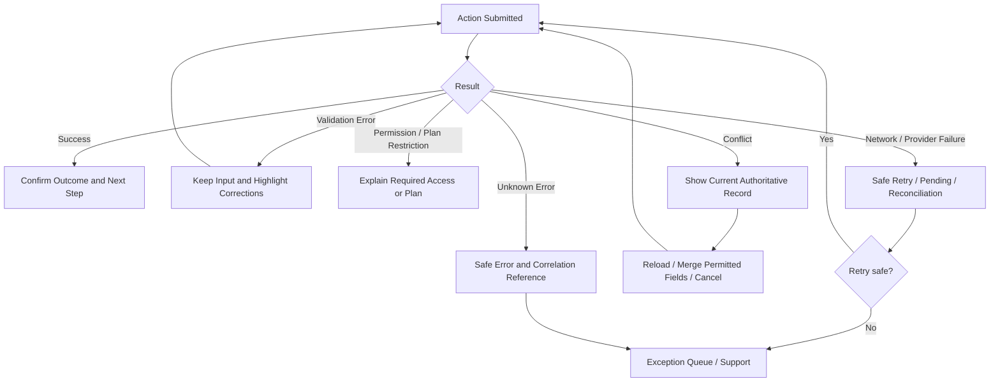

# 17. OFFLINE TECHNICIAN WIREFLOW

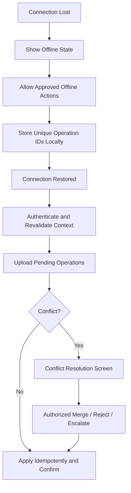

# 18. NAVIGATION RULES

- Dashboard cards open a filtered canonical list, not a disconnected duplicate page.
- Lists open one canonical record workspace.
- Record stage tabs follow the approved lifecycle and permissions.
- Back returns to the previous list with filters and scroll position preserved.
- Save and Exit returns the record to its valid current state.
- Deep links revalidate tenant, branch, role, record, field, subscription, and session access.
- Notifications link to the related authorized record or safe fallback page.
- Customer tracking links never expose internal job identifiers or staff-only data.

# 19. NON-TECHNICAL USER FLOW RULES

- State the purpose of each screen before asking for information.
- Use guided steps for intake, approval, payment, release, configuration, and recovery.
- Ask only for information needed in the current step.
- Reuse known information and avoid asking users to enter it again.
- Use plain-language status labels with an optional detailed operational label for trained staff.
- Show what happened, what is saved, what happens next, and who is responsible.
- Never require the user to understand database, API, event, tenant, entitlement, or synchronization terminology.
- Provide safe defaults and visible review before irreversible actions.

# 20. WIREFLOW VALIDATION MATRIX

| Flow | Source Application | Destination | Gate Preserved | Exception Path | Status |
|---|---|---|---|---|---|
| Intake to Job Order | Front Desk / Portal | Shared Service Workflow | Yes | Yes | Complete |
| Queue to Assignment | Front Desk / Dispatcher | Technician | Yes | Yes | Complete |
| Diagnosis to Quote | Technician | Front Desk / Finance / Customer | Yes | Yes | Complete |
| Quote to Parts / Repair | Customer / Finance | Inventory / Technician | Yes | Yes | Complete |
| Repair to Testing | Technician | Testing | Yes | Yes | Complete |
| Testing to Quality | Technician / Tester | Quality | Yes | Yes | Complete |
| Quality to Payment / Release | Quality | Finance / Front Desk / Customer | Yes | Yes | Complete |
| Release to Warranty | Front Desk | Warranty / Portal | Yes | Yes | Complete |
| Warranty Return | Portal / Front Desk | Technician / Quality / Owner | Yes | Yes | Complete |
| Owner Approval | Any protected workflow | Authorized Approver | Yes | Yes | Complete |
| Subscription Lifecycle | Platform / Tenant Owner | All Applications | Yes | Yes | Complete |
| Support Access | Tenant / Platform Support | Controlled Tenant Session | Yes | Yes | Complete |
| Offline Synchronization | Technician App | Shared Platform | Yes | Yes | Complete |

## STATUS

- Entry and application routing: COMPLETE.
- Intake, queue, assignment, diagnosis, quotation, parts, repair, testing, quality, payment, release, warranty, and closure flows: COMPLETE.
- Owner, subscription, support-access, error, offline, and recovery flows: COMPLETE.
- Navigation and non-technical-user flow rules: COMPLETE.
- Cross-application flow validation: COMPLETE.

**WIREFLOW ARCHITECTURE COMPLETE (100%)**
