# CROSS-DEPARTMENT OPERATING FABRIC — WIREFLOW ARCHITECTURE

## Purpose

Define the literal connections between all departments, applications, portals, services, documents, approvals, tasks, events, and failure paths.

# 1. Universal process start and participation

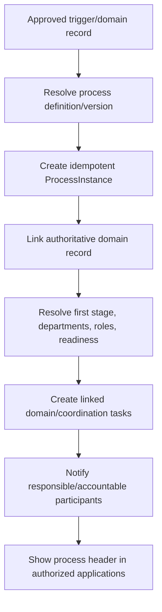

# 2. Department handoff lifecycle

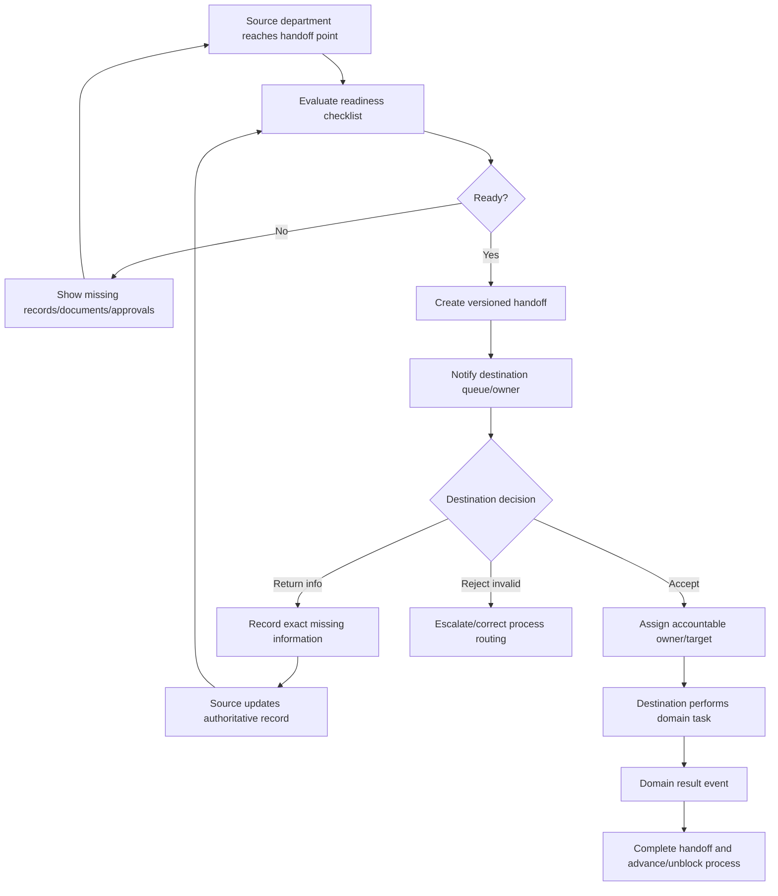

# 3. Customer request to repair closure

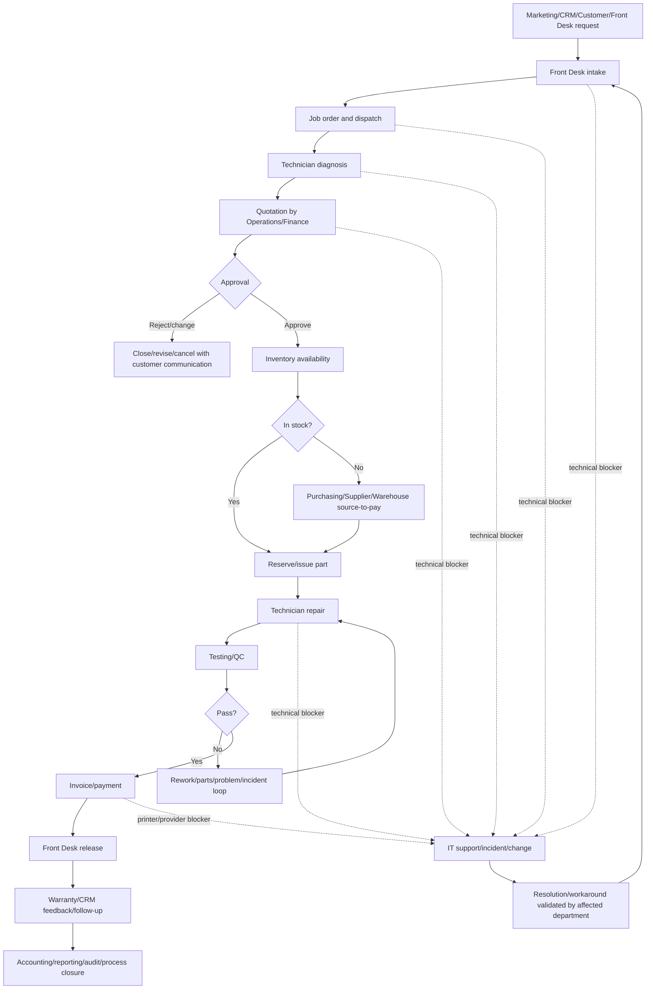

# 4. Source to pay and repair fulfilment

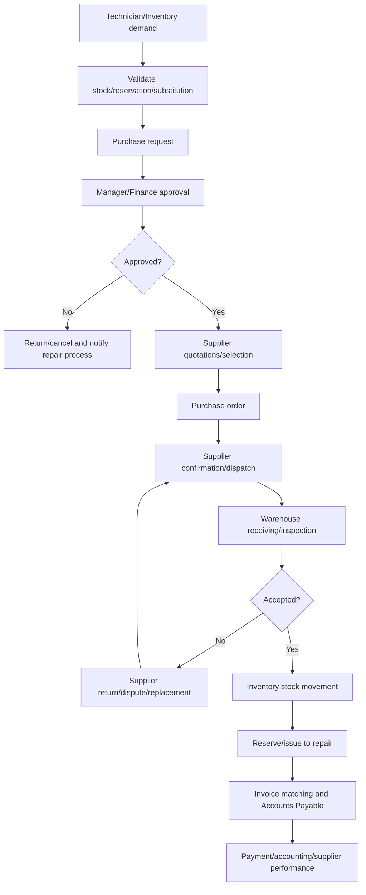

# 5. Quote to cash and record to report

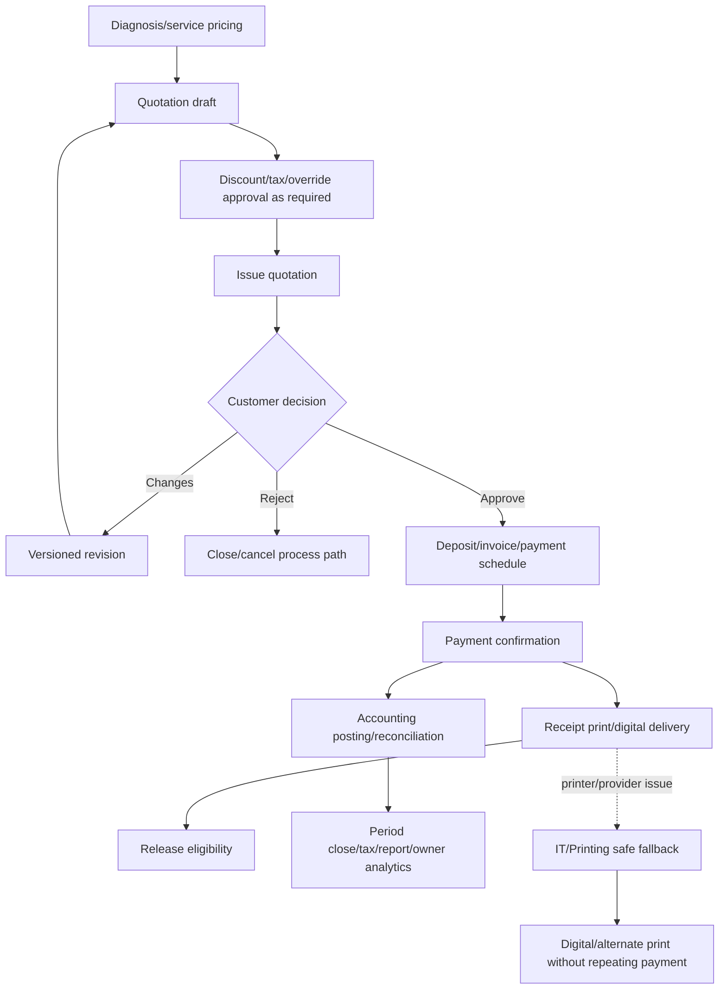

# 6. Hire to operate to offboard

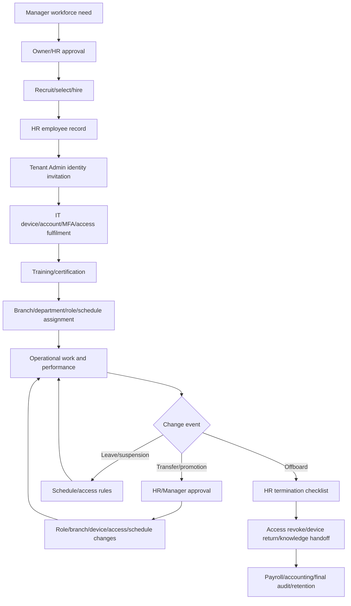

# 7. Lead/campaign to service and retention

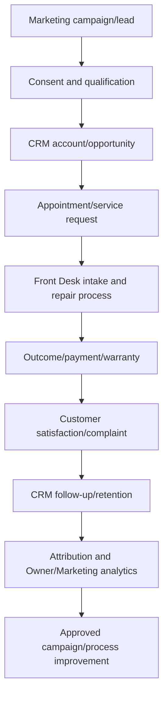

# 8. Warranty return and customer complaint

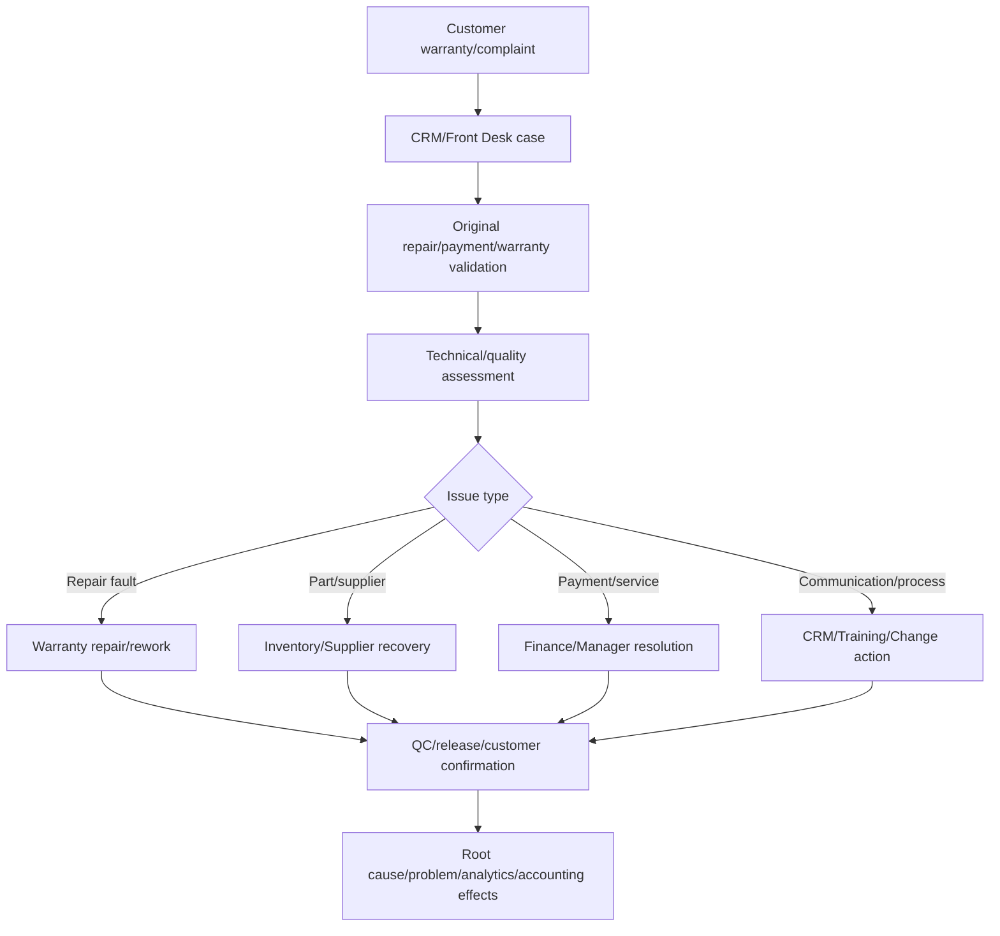

# 9. IT blocker connected to any department

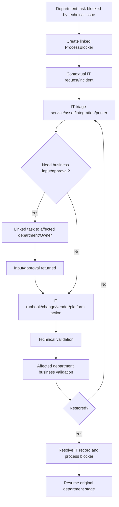

# 10. Cross-branch transfer

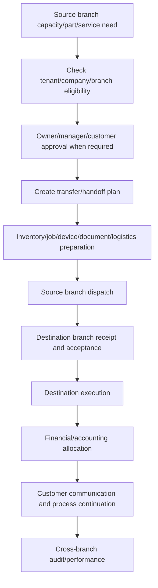

# 11. Approval changed-source flow

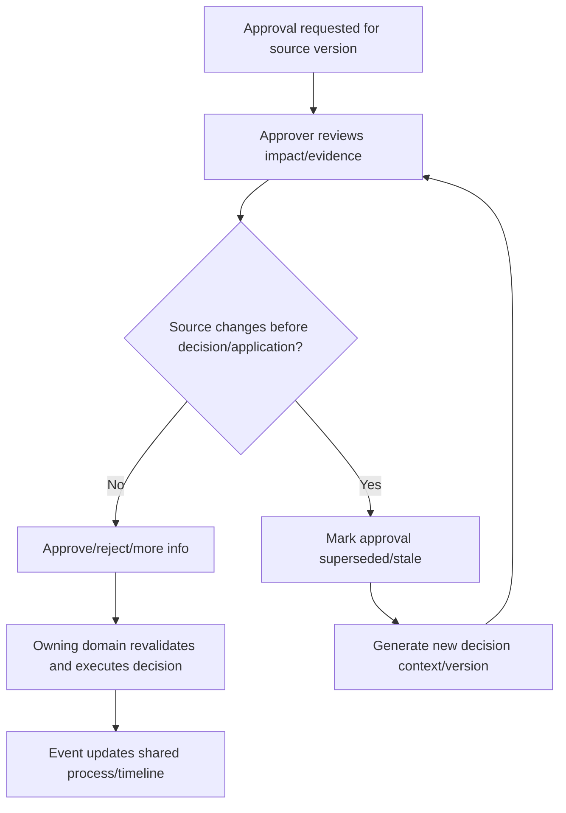

# 12. Coordinated customer communication

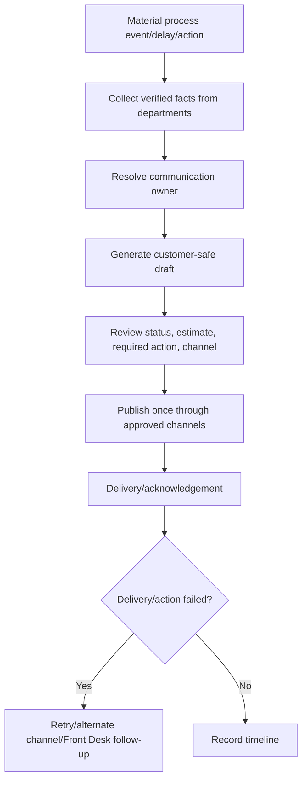

# 13. AI recommendation to controlled action

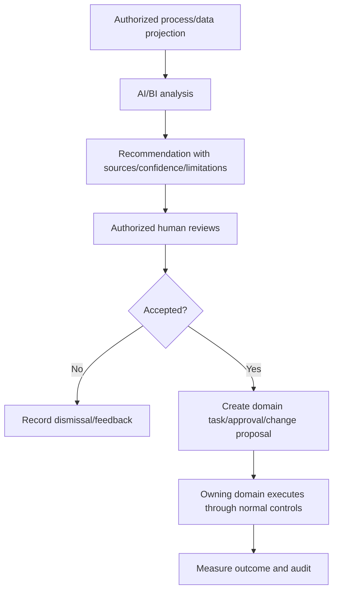

# 14. Process cancellation/compensation

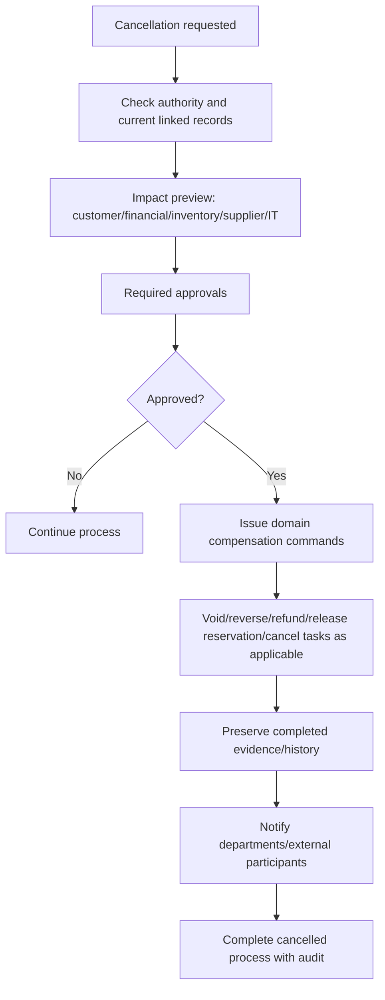

# 15. Event failure and reconciliation

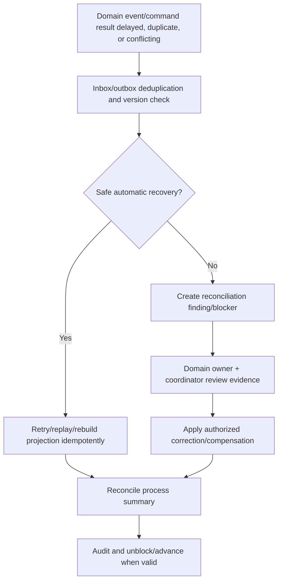

# 16. Owner cross-department decision flow

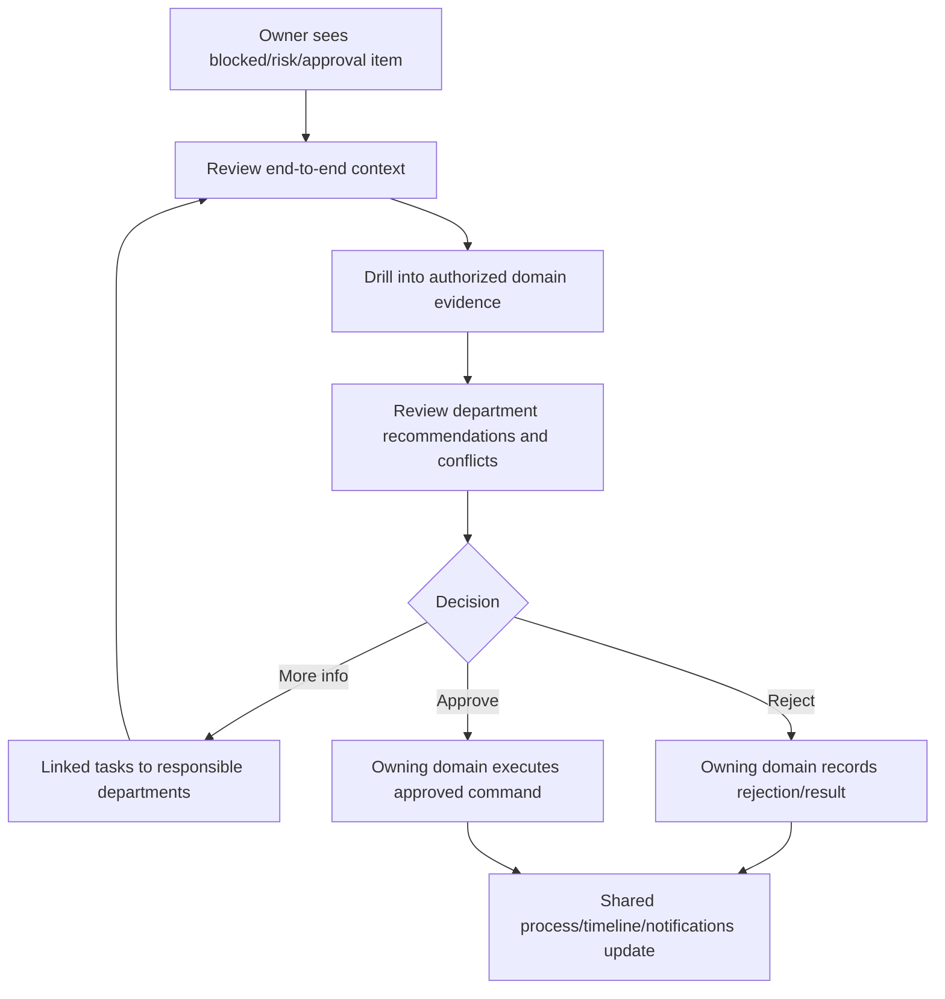

## Global handoff map

```text
Customer/Marketing/CRM → Front Desk
Front Desk → Dispatch → Technician → QC → Front Desk/Finance
Technician → Inventory/Purchasing → Supplier/Warehouse → Technician
Finance → Accounting → Owner/Audit
HR → Tenant Admin/IT/Managers/Accounting
All departments ↔ IT Operations
IT Operations ↔ Platform Support/Vendors
All domains → BI/AI → controlled recommendations
Owner/Managers ↔ approvals/oversight across all departments
```

## Failure rules

- The shared process never repeats a domain transaction merely because coordination failed.
- Every failure identifies whether the authoritative domain operation succeeded.
- Valid input, artifacts, and decisions are preserved.
- Retry/compensation is idempotent.
- Customer messages remain coordinated.
- A department cannot mark another department's task complete.
- IT resolution does not close business work without business validation.
