# PLANS AND BILLING — WIREFLOW ARCHITECTURE

## Purpose

This is the canonical detailed wireflow for Free, Pro, Premium, tenant signup, plan changes, usage, billing recovery, suspension, reactivation, cancellation, platform plan publication, and reconciliation. It extends the global wireflow and never bypasses the subscription state machine, financial controls, permissions, tenant isolation, or entitlement rules.

## Global wireflow rules

- Every transition has a source screen, actor, permission, current-state requirement, validation, command, result, audit event, notification, and failure path.
- Back, save-and-exit, refresh, retry, resume, browser reload, duplicate submit, delayed webhook, and provider outage preserve truthful state.
- A client screen never activates entitlements directly.
- Payment-requiring changes remain pending until trusted payment confirmation and internal apply succeed.
- Provider events are verified, deduplicated, durably accepted, asynchronously processed, and reconciled.
- No failed flow silently falls back to a paid feature, lower price, higher limit, or destructive resource removal.
- Customer-facing and non-owner staff messages use plain language and do not expose payment secrets, platform internals, or security investigation details.

# 1. PUBLIC PLAN ENTRY AND ROUTING — `PB-FLOW-01`

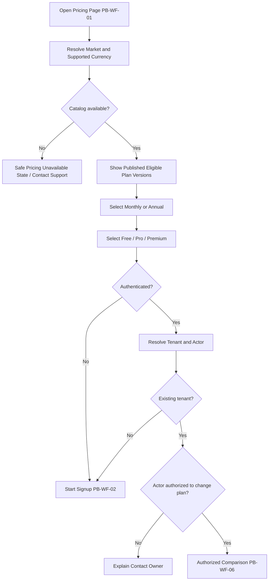

Failure paths:

- Price book changed after page load: backend rejects stale selection and reloads current catalog.
- Unsupported currency/market: show available options; never convert silently.
- Retired plan deep link: show replacement options and migration explanation.

# 2. SIGNUP, TRIAL ELIGIBILITY, AND TENANT PROVISIONING — `PB-FLOW-02`

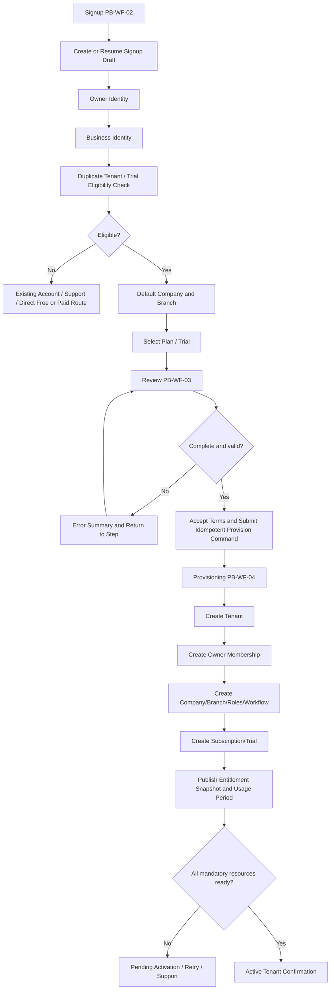

Retry/resume:

- Signup draft uses an opaque resume token or authenticated draft.
- Final provisioning uses one idempotency family and returns the prior logical result on duplicate submit.
- Partial provisioning records each completed step and compensates only approved reversible resources.
- Tenant is not `ACTIVE` until mandatory resource verification passes.

# 3. TRIAL EXPIRY AND CONVERSION — `PB-FLOW-03`

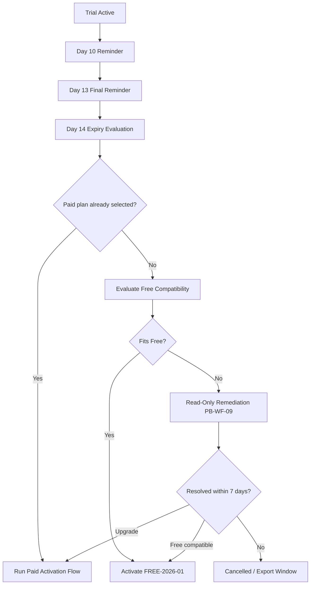

Rules:

- No automatic paid conversion without explicit billing authorization.
- Active repair continuity remains available during the remediation window.
- Trial usage carries into the current target-plan period according to published policy.

# 4. SUBSCRIPTION OVERVIEW ROUTING — `PB-FLOW-04`

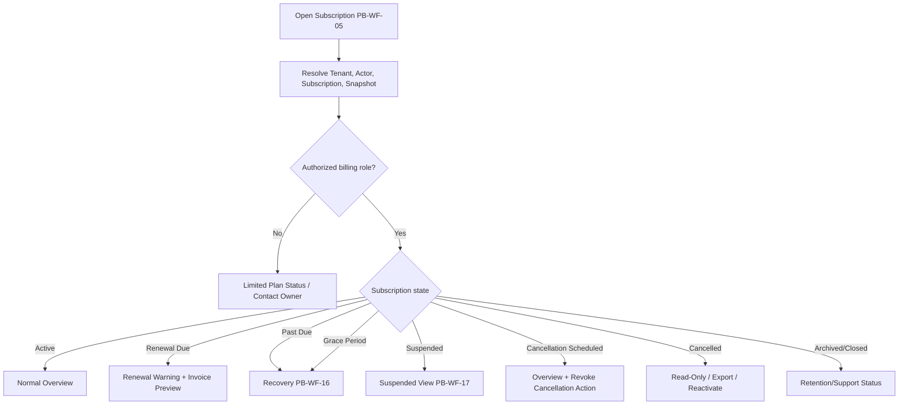

# 5. UPGRADE PREVIEW, PAYMENT, AND ACTIVATION — `PB-FLOW-05`

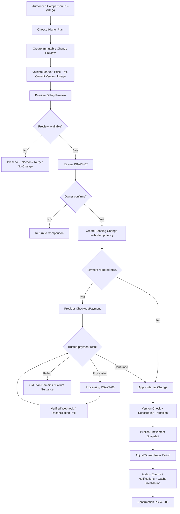

Critical failure paths:

- Payment succeeded, internal apply failed: create reconciliation; retry internal apply with same change/event; never charge again.
- Snapshot publish failed: do not claim complete; preserve safe previous snapshot and core continuity; reconcile.
- Webhook duplicated: return prior durable processing result.
- Webhook delayed: show processing, not failure; owner can refresh safely.
- Current subscription version changed after preview: reject and rebuild preview.

# 6. DOWNGRADE PREFLIGHT AND REMEDIATION — `PB-FLOW-06`

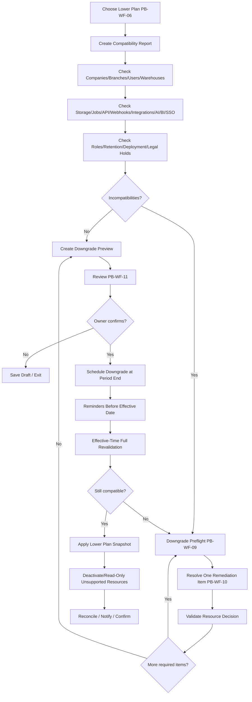

Rules:

- Resource selection is explicit. No automatic branch/user/company deletion.
- Scheduled downgrade can be revoked before irreversible provider/deployment work.
- Storage over target preserves files and blocks optional new upload.
- SSO cannot turn off before tested local owner access exists.
- Dedicated-to-pooled migration is a separate migration flow with backup and rollback.

# 7. MONTHLY/ANNUAL RENEWAL — `PB-FLOW-07`

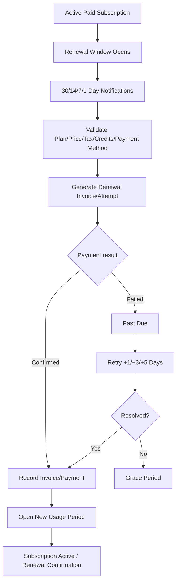

Free renewal opens the next usage period without invoice/charge.

# 8. USAGE INGESTION, WARNING, AND LIMIT — `PB-FLOW-08`

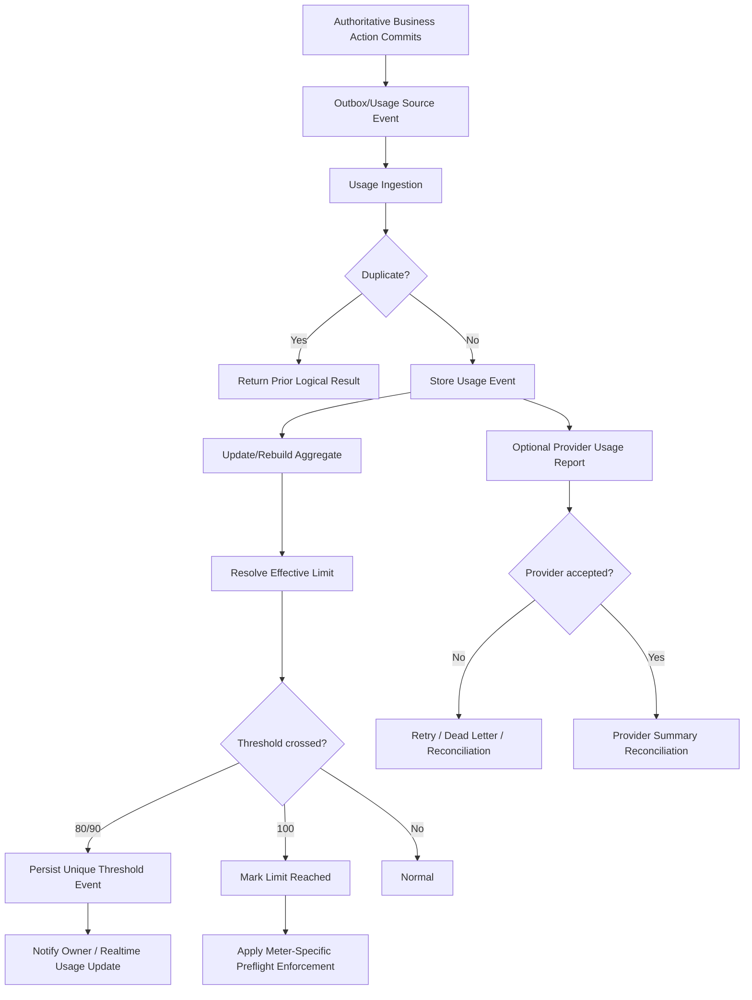

Action preflight:

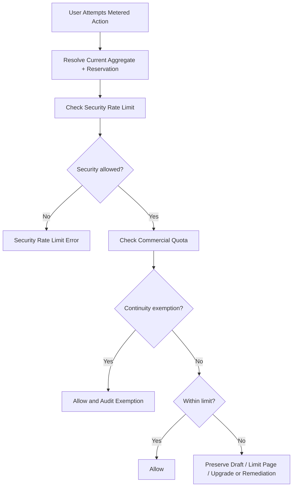

# 9. USAGE DASHBOARD AND DISPUTE — `PB-FLOW-09`

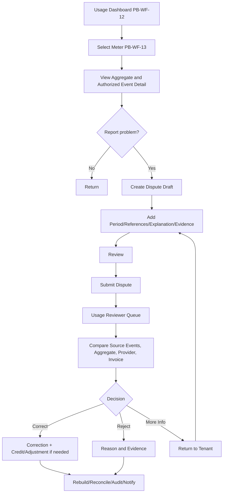

# 10. PAST-DUE AND GRACE RECOVERY — `PB-FLOW-10`

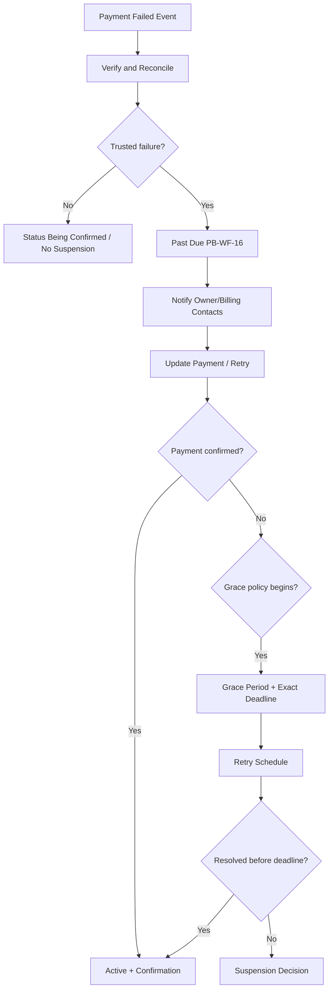

Provider unavailable never equals trusted failure.

# 11. SUSPENSION AND REACTIVATION — `PB-FLOW-11`

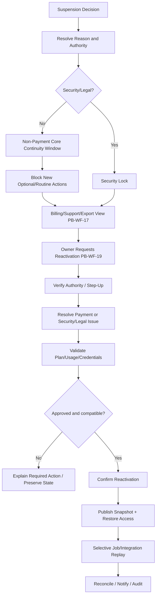

# 12. CANCELLATION, EXPORT, ARCHIVE, AND CLOSURE — `PB-FLOW-12`

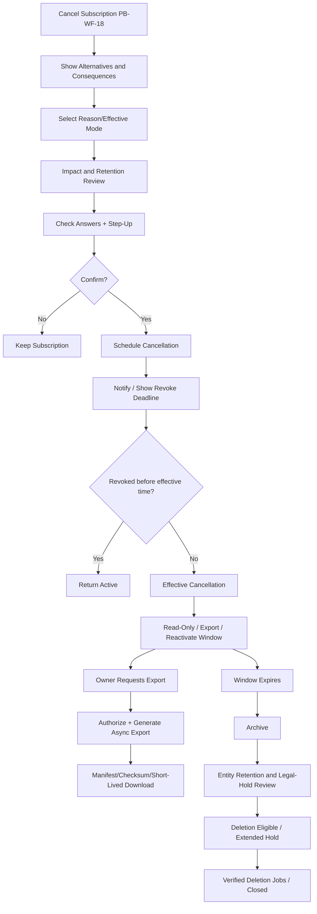

Cancellation submit is idempotent. Export failure does not advance deletion eligibility without policy evidence.

# 13. BILLING ACCOUNT AND PAYMENT METHOD — `PB-FLOW-13`

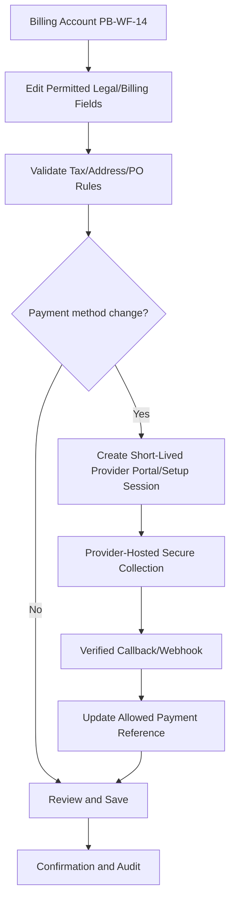

Raw payment credentials never pass through ordinary business forms.

# 14. PLATFORM PLAN VERSION AUTHORING AND PUBLICATION — `PB-FLOW-14`

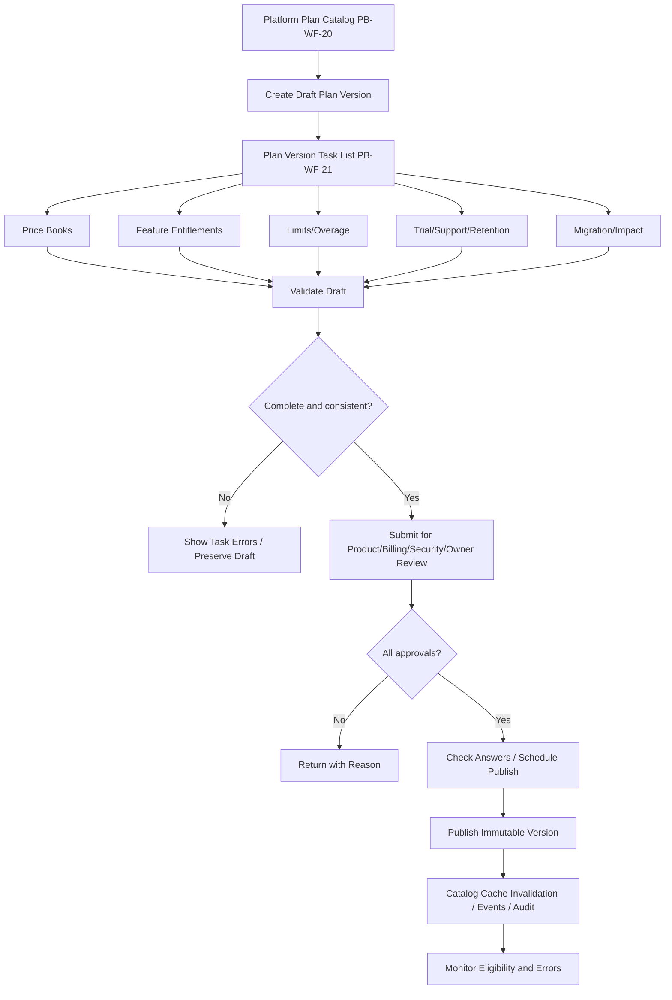

Published semantic data cannot be edited. A correction requires replacement version unless display-only.

# 15. TEMPORARY ENTITLEMENT OVERRIDE — `PB-FLOW-15`

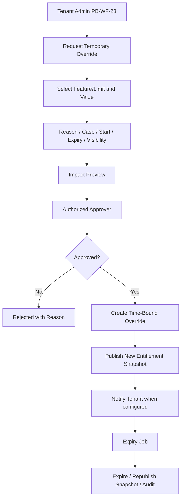

No override can be permanent or silently renewed.

# 16. PROVIDER WEBHOOK PROCESSING — `PB-FLOW-16`

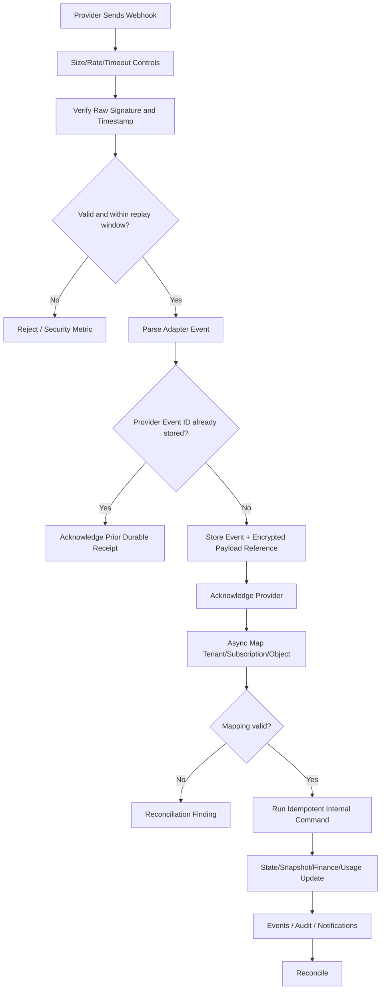

# 17. RECONCILIATION QUEUE — `PB-FLOW-17`

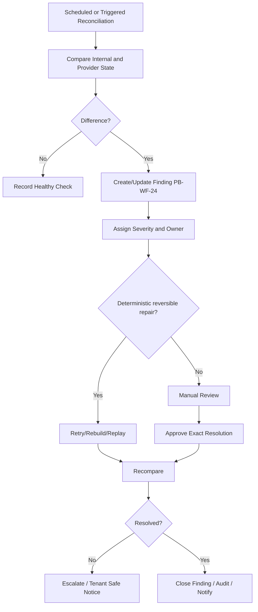

Never auto-charge, refund, delete, upgrade, downgrade, or revoke tenant resources during generic reconciliation.

# 18. DIRECT ACCESS TO NON-ENTITLED FEATURE — `PB-FLOW-18`

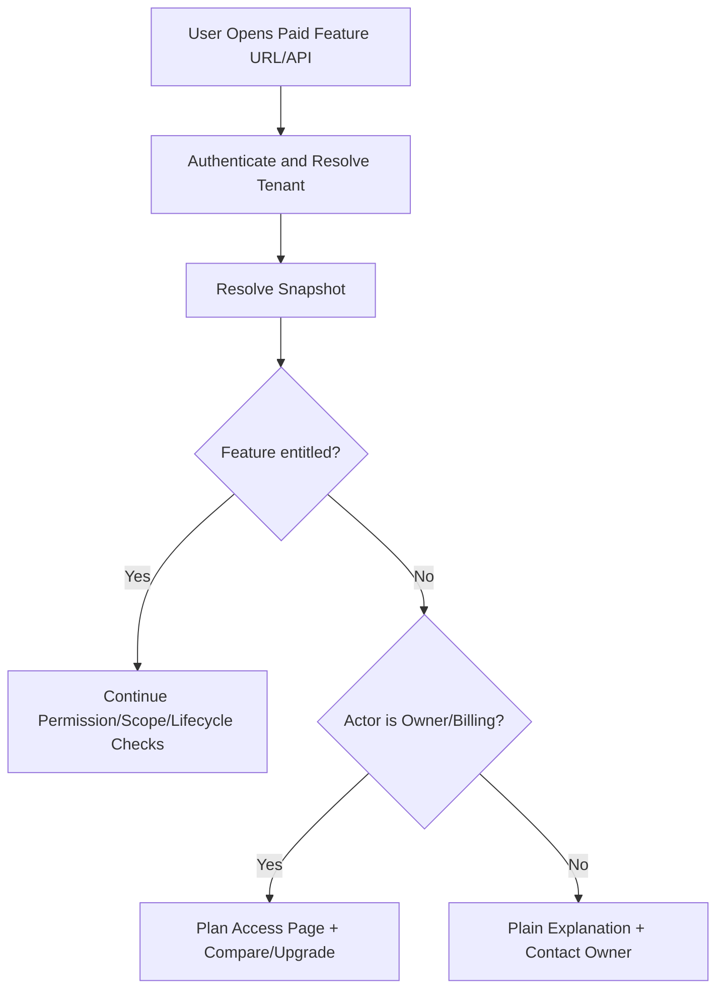

The server returns a stable entitlement error. Hiding navigation is supplemental only.

# 19. OFFLINE AND STALE CLIENT BEHAVIOR — `PB-FLOW-19`

- Subscription change, payment confirmation, plan publication, override, suspension, reactivation, cancellation, and provider operations require online authoritative validation.
- Offline core repair drafts can continue only under previously validated permission and continuity policy; reconnect refreshes subscription and entitlements before protected submit.
- A stale client showing an old entitlement cannot execute a protected action; backend returns current plan/access state and preserves valid draft data.
- Usage display can show last-known values with timestamp but cannot promise remaining quota when offline.

# 20. UNIVERSAL ERROR, RETRY, AND RESUME — `PB-FLOW-20`

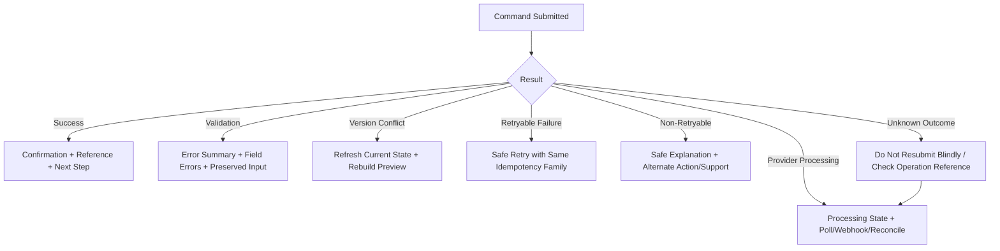

## Wireflow completion criteria

- Every `PB-WF-01` through `PB-WF-24` screen is reached by at least one documented wireflow.
- Normal, alternate, rejection, exception, cancellation, retry, resume, conflict, provider-delay, reconciliation, and recovery paths exist.
- No path directly changes plan access from frontend state.
- Every financial/configuration completion has a review and confirmation stage.
- Downgrade/cancellation never silently deletes data.
- Usage enforcement has continuity paths.
- Platform plan publication and tenant override require approvals and immutable/auditable results.

## Status

`PLANS_BILLING_WIREFLOW_ARCHITECTURE_COMPLETE`
