# PRINTING AND PERIPHERAL OPERATIONS — WIREFLOW ARCHITECTURE

## Purpose

Connect staff actions, owner governance, IT administration, document state, printer capability, print adapters, failures, recovery, and audit without weakening payment, release, inventory, warranty, or security workflows.

# 1. Standard staff print flow

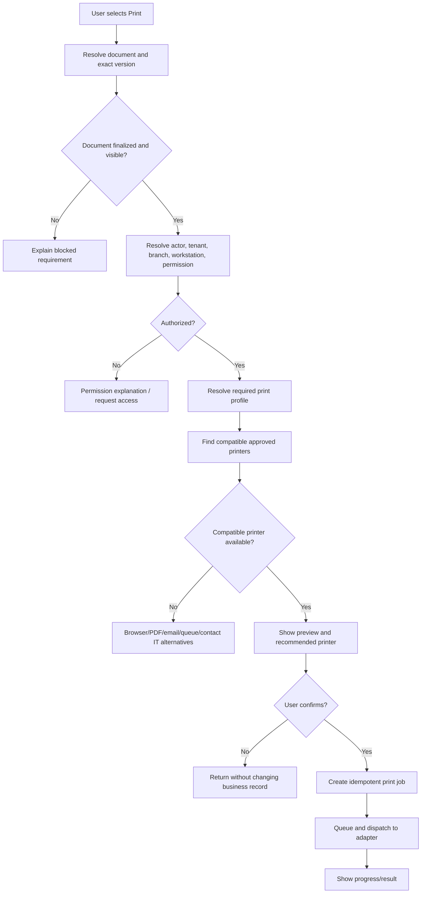

# 2. Managed printer success flow

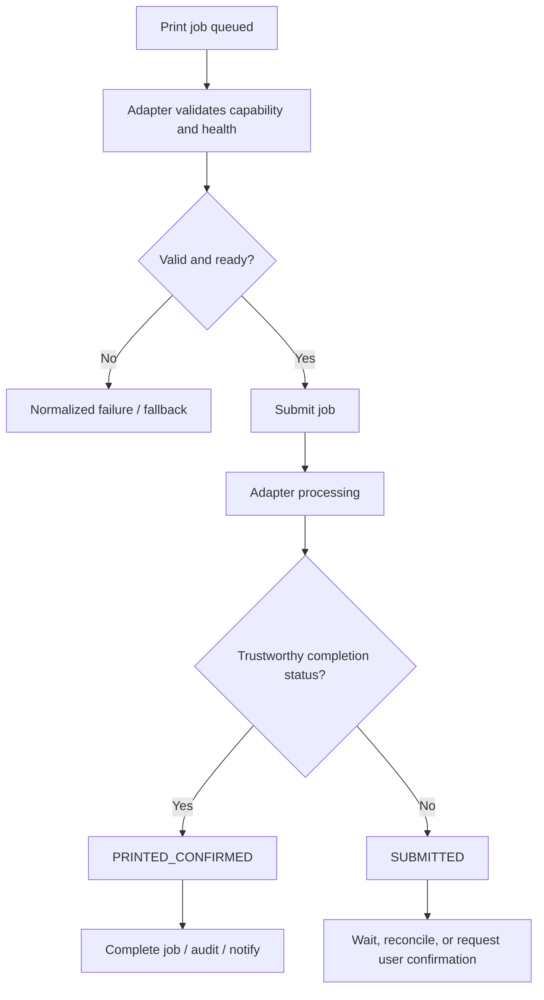

# 3. Browser/OS dialog flow

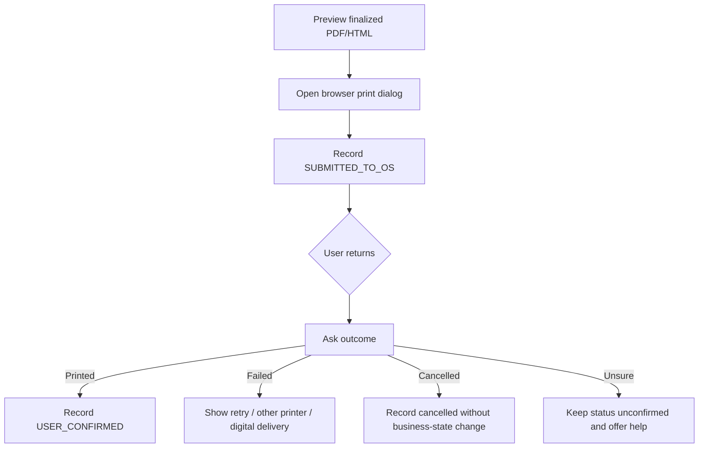

# 4. Cashier payment receipt flow

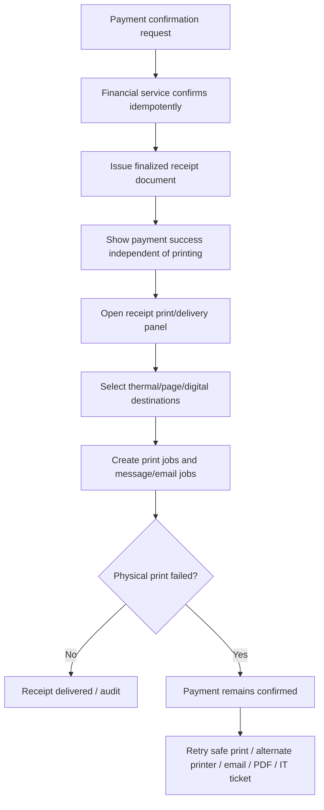

# 5. Intake and job-order multi-output flow

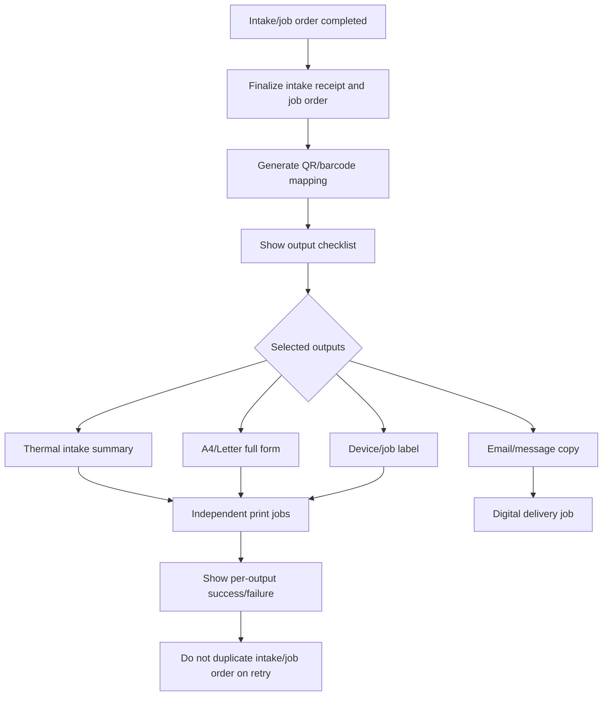

# 6. Reprint flow

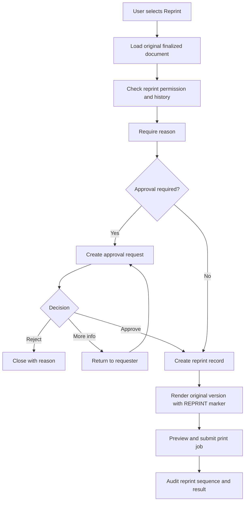

# 7. Thermal ESC/POS flow

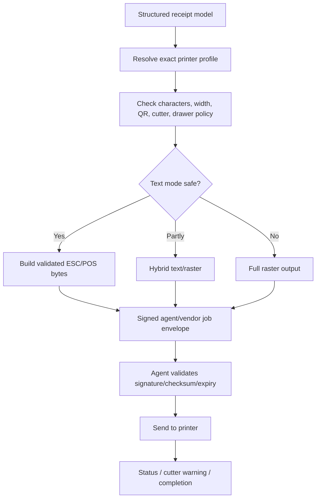

# 8. Printer offline or paper-out flow

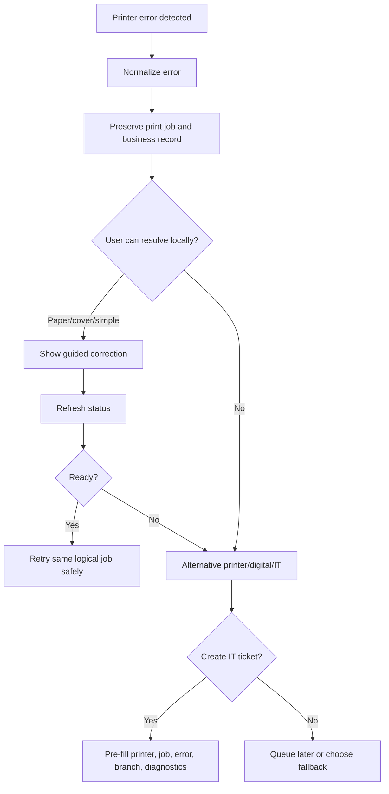

# 9. Local agent enrollment flow

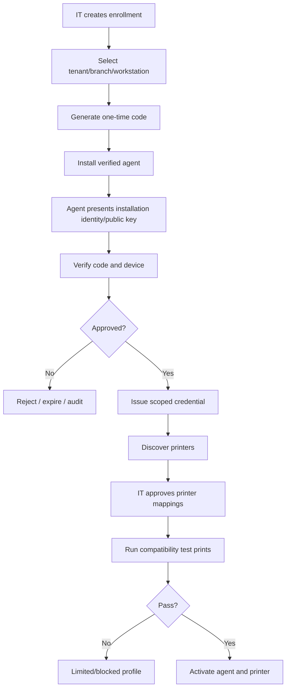

# 10. Printer enrollment and certification flow

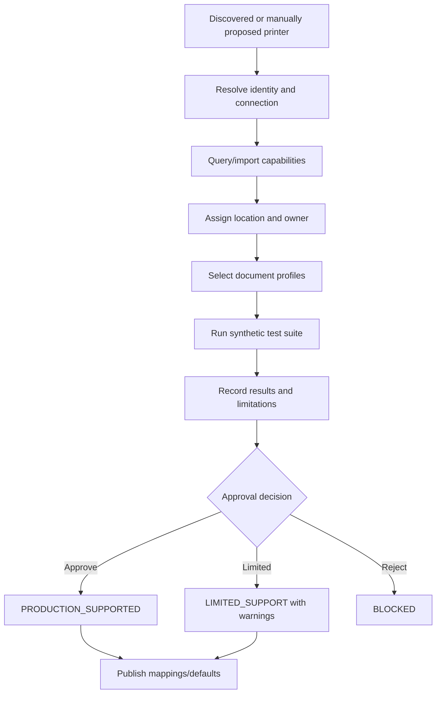

# 11. Inventory batch label flow

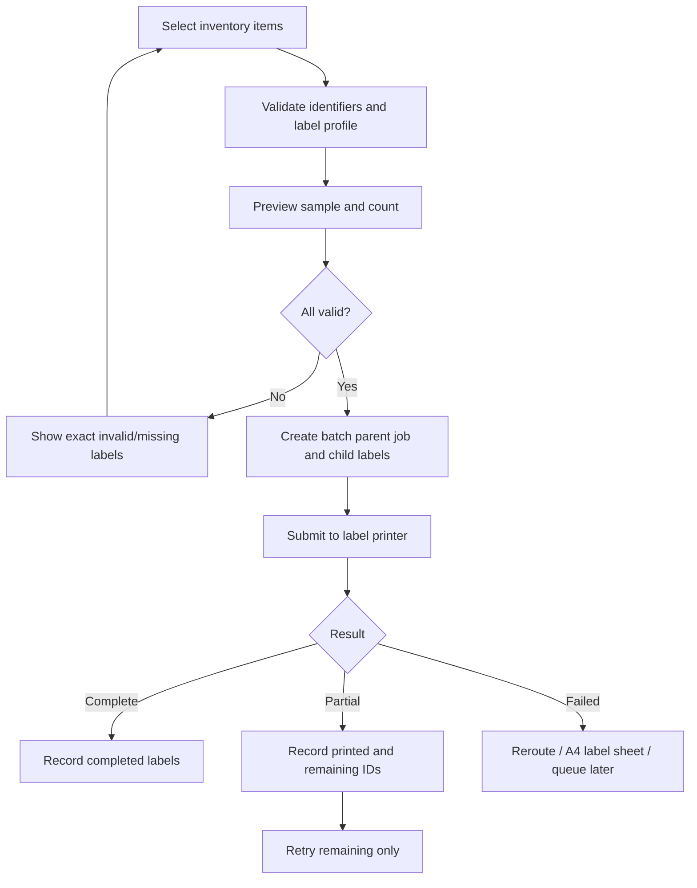

# 12. Owner policy publication flow

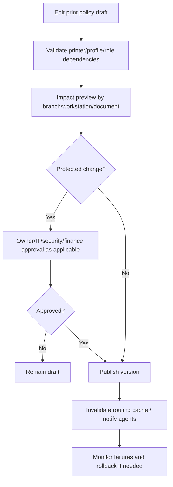

# 13. Agent offline/reconnect flow

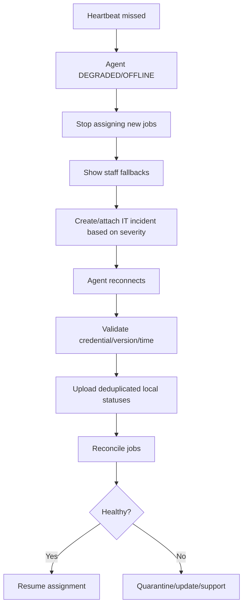

# 14. Unauthorized direct URL/API print flow

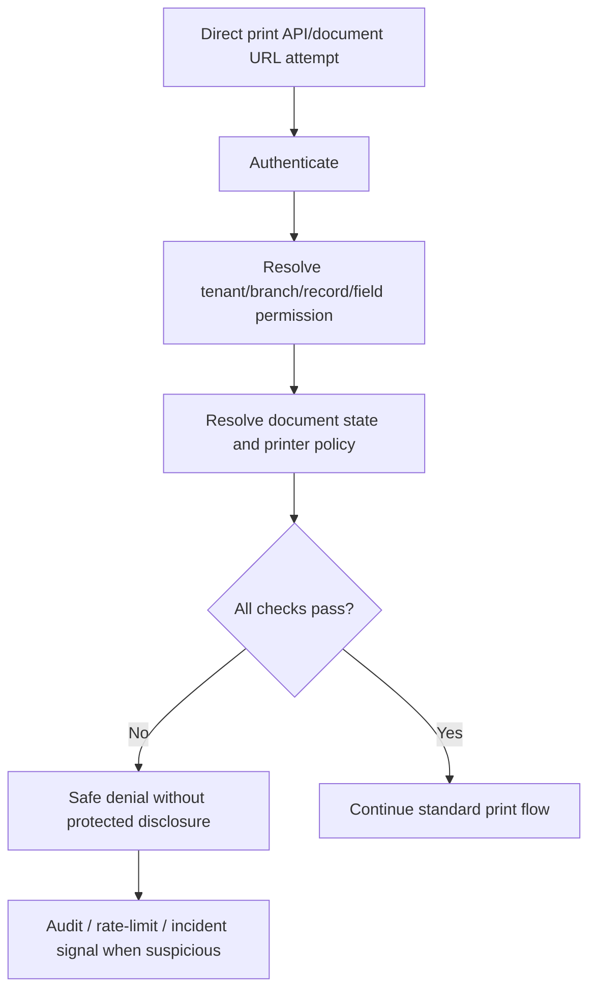

# 15. Print reconciliation flow

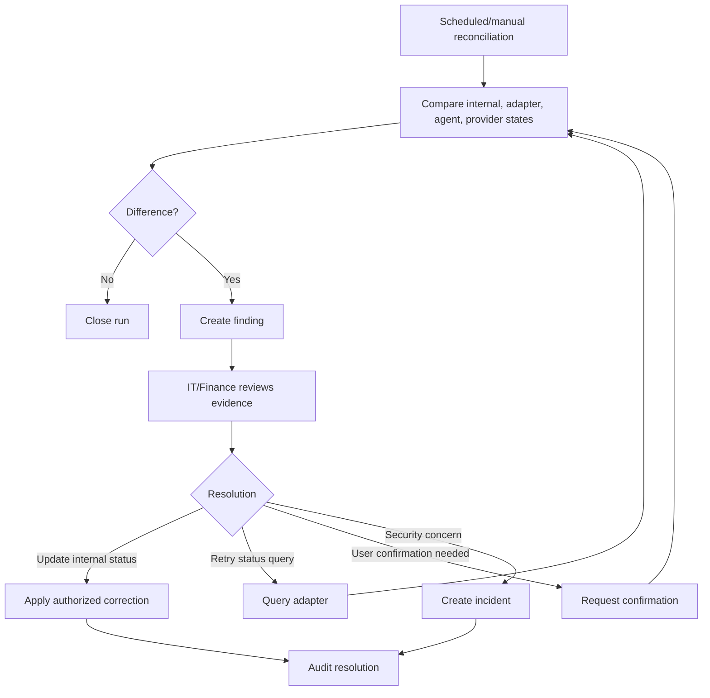

# 16. Universal failure/recovery flow

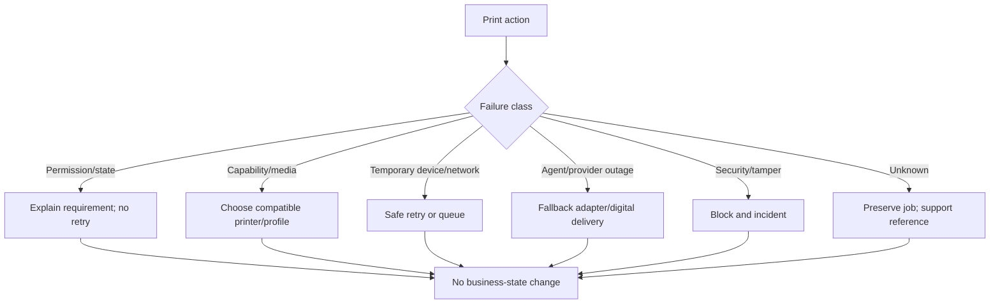

## Cross-application handoffs

| Source | Destination | Handoff |
|---|---|---|
| Front Desk | Print Orchestrator | intake/job/release document print request |
| Cashier/Finance | Print Orchestrator | confirmed receipt/invoice/reprint request |
| Technician | Print Orchestrator | technical report/device label request |
| Inventory | Print Orchestrator | part/bin/batch label request |
| Owner | Print Governance | defaults, policy, approval, usage review |
| Print Orchestrator | IT Operations | device/agent/queue incident or alert |
| IT Operations | Staff | resolution, temporary workaround, knowledge article |
| IT Operations | Owner | risk, outage, maintenance, cost, and approval summary |
| Platform Support | Tenant IT | approved time-limited support session and findings |

## Completion rules

- Every handoff includes source, destination, readiness check, result, failure path, and audit.
- No print retry repeats the underlying business command.
- No printer/agent failure silently changes a payment, release, inventory, warranty, or job state.
- Every staff failure path includes at least one safe next action.
